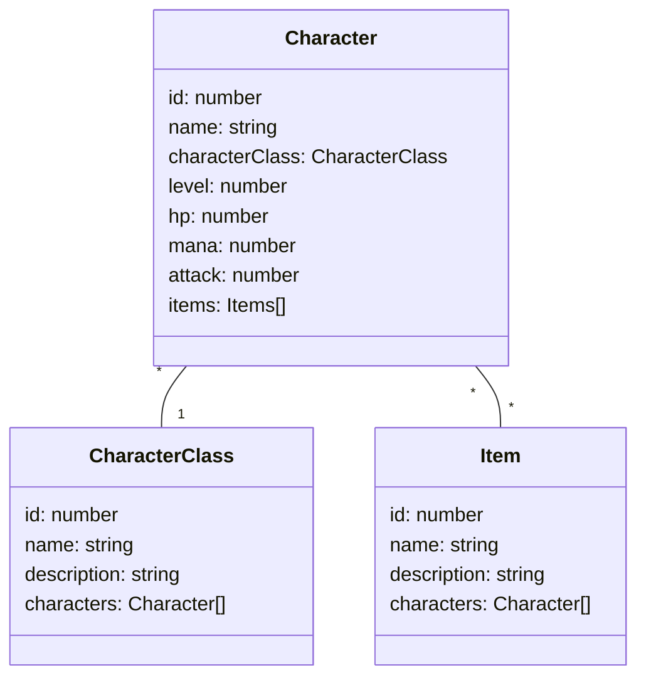

# PoC TypeORM (OxM) 2025

## Introducción

En este ejemplo vamos a desarrollar los CRUD (ABMC) utilizando una API REST con express y utilizando un ORM (object relational mapper) u ODM (object document mapper) para la persistencia. Cuando un mismo mapper sirve tanto para la persistencia en bases de datos relacionales como en document store se suele nombrar como OxM ya que permite mapear a más de uno.

El OxM que utilizaremos es [TypeORM](https://typeorm.io/). Que tiene soporte para múltiples bases de datos relacionales, entre ellas MySQL, la cual será la que utilizaremos.

Para poder demostrar los beneficios de TypeORM se implementa relaciones 1aN y NaM.
Items y CharacterClass serán entidades que se relacionan con Character en una relación NaM y 1aN respectivamente. Esto se puede visualizar mediante el diagrama de clases que se encuentra a continuación:

## Class diagram

## Lectura Adicional

Basado en los patrones:

- [Data Mapper](https://www.martinfowler.com/eaaCatalog/dataMapper.html),
- [Documentación de TypeORM](https://typeorm.io/docs/getting-started/)