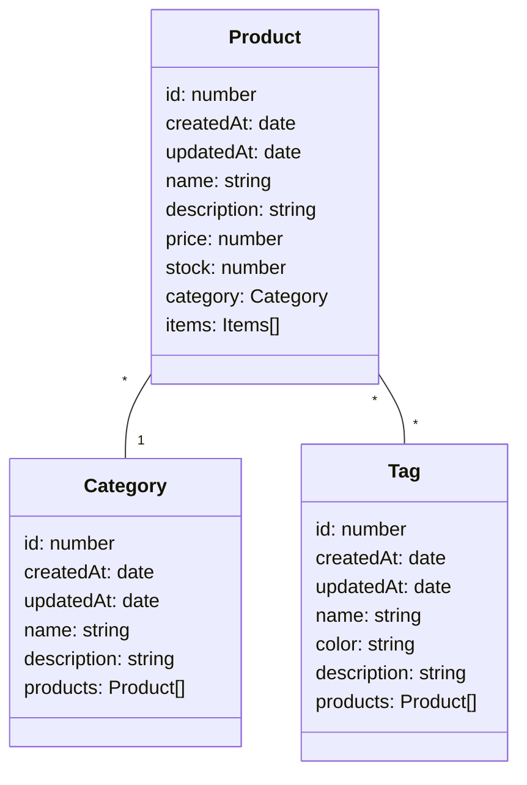

# PoC TypeORM (OxM) 2025

## Introducción

El propósito de este proyecto es construir una API REST completamente funcional para gestionar un catálogo de productos. A través de este desarrollo, demostraremos cómo implementar un sistema de CRUD (Create, Read, Update, Delete), también conocido en español como ABMC (Alta, Baja, Modificación, Consulta), utilizando un stack tecnológico moderno y robusto basado en Node.js.

## Arquitectura Tecnológica

La base de nuestra aplicación será Express.js, un framework minimalista y flexible que nos permitirá levantar un servidor y definir las rutas de nuestra API de manera rápida y organizada.

Para la capa de persistencia, nos alejaremos de la escritura de consultas SQL manuales. En su lugar, utilizaremos un ORM (Object-Relational Mapper). Un ORM actúa como un traductor o puente entre el mundo de la programación orientada a objetos (nuestras clases en TypeScript) y el mundo de las bases de datos relacionales (las tablas en MySQL).

El ORM elegido es [TypeORM](https://typeorm.io/). Lo hemos denominado un "OxM" (Object-X-Mapper) porque, si bien lo usaremos con una base de datos relacional como MySQL, su diseño le permite trabajar también con bases de datos documentales (NoSQL), aunque este último uso se lo considera deprecado. La principal ventaja de TypeORM es su profunda integración con TypeScript, lo que nos permite definir un modelo de datos fuertemente tipado, coherente y autodescriptivo, reduciendo errores y mejorando la mantenibilidad del código.

## Modelado de Datos

Una simple gestión de productos no sería suficiente para mostrar el verdadero poder de un ORM. Por ello, el núcleo de esta demostración radica en la implementación de dos de los tipos de relaciones más comunes y fundamentales en cualquier aplicación:

### Relación Uno a Muchos (1-a-N): _Category_ y _Product_

- Concepto: Un producto debe pertenecer a una y solo una categoría, mientras que una categoría puede englobar a múltiples productos.
- Analogía: Pensemos en las secciones de un supermercado. Un producto como la "Leche Entera" solo puede estar en la sección de "Lácteos". Sin embargo, la sección "Lácteos" contiene muchísimos productos diferentes. Esta estructura jerárquica es la que modelaremos.

Para poder demostrar los beneficios de TypeORM se implementamos relaciones 1aN y NaM.
Tag y Category serán entidades que se relacionan con Product en una relación NaM y 1aN respectivamente. Esto se puede visualizar mediante el diagrama de clases que se encuentra a continuación:

### Relación Muchos a Muchos (N-a-M): _Product_ y _Tag_

- Concepto: Un producto puede tener asociadas múltiples etiquetas (tags) para describirlo mejor, y, a su vez, una misma etiqueta puede ser asignada a infinidad de productos.

- Analogía: Similar a las etiquetas en un blog o una red social. Un producto como unas "Zapatillas Deportivas" podría tener las etiquetas "Oferta", "Nuevo Lanzamiento" y "Running". Al mismo tiempo, la etiqueta "Oferta" se puede aplicar a camisetas, accesorios y otros productos. TypeORM gestionará la tabla intermedia necesaria para que esta compleja relación funcione de manera transparente para nosotros.

### Class diagram

## Patrón de Diseño

Para la interacción entre nuestra lógica de negocio y la base de datos, hemos optado por implementar el patrón de diseño _**Active Record**_. Este enfoque es uno de los dos patrones que TypeORM soporta de forma nativa (siendo el otro el patrón _**Data Mapper**_).

El patrón _**Active Record**_ propone que el propio objeto o modelo de datos sea responsable de su propia persistencia. En lugar de tener una clase que solo contiene datos (como _Product_) y otra clase separada que se encarga de guardarla en la base de datos, el patrón _**Active Record**_ fusiona estas dos responsabilidades en una sola clase.

Esto significa que nuestras entidades (_Product_, _Category_, _Tag_) no solo contendrán propiedades como name o price, sino que también tendrán métodos para interactuar directamente con su tabla correspondiente en la base de datos.

## Lectura Adicional

- [Data Mapper](https://www.martinfowler.com/eaaCatalog/dataMapper.html),
- [Documentación de TypeORM](https://typeorm.io/docs/getting-started/)
